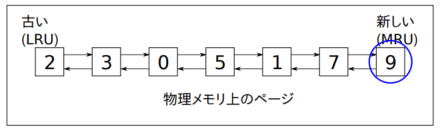
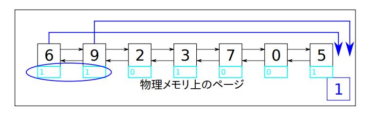
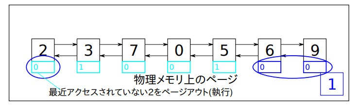
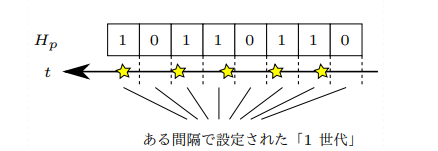
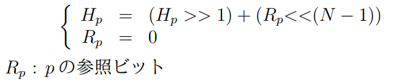

# 論理アドレス空間

**プロセスごとに**論理アドレス（↔物理アドレス）空間を作る

論理アドレスの範囲は物理メモリの量によらず、OSによって決まり、論理アドレスと物理アドレスの変換はCPUが行う。**対応する物理アドレスが存在するとは限らない**。

# メモリ管理ユニット(MMU)
CPU内のハードウェアでメモリアクセスに介在する。論理アドレスに対して、
1. アドレス権の検査
2. 対応する物理アドレスの有無の検査
3. 存在していればアクセス
を行う。
MMUによって
1. プロセス間でメモリの分離
2. カーネルの保護
3. 物理メモリ量を超えたメモリ割り当て
4. 要求時ページング
   1. 物理メモリを確保せずに論理アドレスを割り当てる（高速）
が行える

## アドレス交換のやり方
論理アドレス → 物理アドレス/アクセス許可への写像を作る
すべてのアドレスに対応する情報をもたせるのは非現実的なので、ページングを行う。

$$ 2^{48}\times 8 \times Process = 2PB \times Process $$

最下位Abit(大体12bit or 13bit)**以外共通**の2^A個のアドレスからなる領域をページと言う。ページのサイズが大きいほど、ページテーブルのサイズが小さくなるので、メモリの節約になる。ページのサイズが小さいほど、ページテーブルのサイズが大きくなるので、ページテーブルのアクセスが遅くなる。

アクセス許可情報や、物理アドレス（オフセット以外）は、ページごとに一つもたせる。
これで必要なものは、以下の写像になる。

論理ページ → アドレス許可/物理ページ番号

この論理ページto物理ページ番号をページテーブルという形で実現する。ただし、論理ページ番号をただの配列とすると2^36個の要素をもつ配列が必要になるので、ページテーブルは多段ページテーブルで実現される。例えば

2^9 -> 次の2^9 -> 次の 2^9 -> 次の2^9

というふうに4段にする。最悪の場合、512GB必要なのは変わらないが、ほとんどのプロセスは論理アドレス空間のごく一部しか使わないので、下位の表は殆どの場合不要になり、多段ページテーブルの場合、効率が良い。（不要なページテーブルは作成しないので）

## ページテーブルエントリ
ページテーブルのエントリは、以下のようになる。
- P : 1ならページが存在する
  - W : 1なら書き込み可能
  - U : 1ならユーザープロセスからアクセス可能
  - A : 1ならアクセスされた
  - D : 1なら書き込みされた
  - PFN : 物理ページ番号

# TLB(Translation Lookaside Buffer)
毎回論理アドレスの変換のために4回メモリアクセスはだるい
→TLB（CPU内のキャッシュ）内に一部の写像を保存しておく（1024個程度 36bit x2 x 1024 = 9KiB程度？）

# UNIXのメモリ割当API
- `brk(l)`
  - データセグメントの終わりのアドレスをlにする。
- `sbrk(sz)`
  - プロセスのデータセグメントの境界をszだけ伸ばす
  - `sbrk(0)`で現在のデータセグメントの終わりのアドレスを返す

- `mmap, mremap, munmap` 
  - めっちゃ大事なやつら

- `mprotect(a, sz, prot)`
  - メモリ領域aからszバイトのメモリ領域のアクセス権をprotに変更する

メモリを割り当てることによって、**論理アドレスの範囲がアクセス可能になる**。実際にはアドレス空間表に割り当て済みであることを記述するだけで、アクセス発生時にメモリが割り当てられる。

## ページアウト/ページイン
物理メモリが足りなくなったときに、ページアウトを行う。ページアウトは、ページテーブルの物理ページを不在とし、次にアクセスする際にページフォルトが起こるようにしておく。ページアウトされたページは、ページインされるまで、物理メモリには存在しない。

# 資源使用量やメモリの割当状況をしるAPI
- `getrusage`
  - プロセスの資源使用量を返す
- `setrlimit`
  - プロセスの資源使用量の上限を設定する
- `prlimit`
  - プロセスの資源使用量の上限を取得する
- `mincore`
  - メモリ領域のページの存在状況を返す
  - `mincore(addr, len, vec)`で、addrからlenバイトのメモリ領域のページの存在状況をvecに書き込む

# cgrouops
- `cgroup`は、Linuxカーネルの機能で、プロセスのグループを作成し、グループ内のプロセスに対して、資源使用量の上限を設定することができる。

`/sys/fs/cgroup/hoge/`に、`cpu.cfs_quota_us`と`cpu.cfs_period_us`を書き込むことで、CPU使用量の上限を設定できる。`cpu.cfs_quota_us`には、CPU使用量の上限をマイクロ秒単位で書き込む。`cpu.cfs_period_us`には、CPU使用量の上限を計算する周期をマイクロ秒単位で書き込む。`cpu.cfs_quota_us`には、`cpu.cfs_period_us`の周期で、`cpu.cfs_quota_us`マイクロ秒までCPUを使用できる。`cpu.cfs_quota_us`には、`cpu.cfs_period_us`の周期で、`cpu.cfs_quota_us`マイクロ秒までCPUを使用できる。`memory.high`でメモリの使用量の上限を設定できる。

# ページ置換アルゴリズム
物理メモリが足りなくなったときに、どのページをページアウトするかを決めるアルゴリズム。
ページ置換が頻繁に起こる状態をスラッシングという。

オフライン問題（将来のアクセス系列をすべて知っている）に対する最適アルゴリズムは、 $a_i \notin R_i$のときに、常駐ページのうち、次にアクセスされるまでの時間が最も長いページを置換するというもの。 

オンライン問題に対しては、どんなアルゴリズムにしようと最悪のケース（ページフォルト率1）は、避けられない。仕方ないので、**最近使われたものはまたすぐ使われる**という予想をする。（LRU, FIFO, LRUの近似, エイジング）

## LRU
LRUの根拠として、空間局所性及び時間局所性があげられる。未来のアクセスが過去のアクセスの反転であるとして最適アルゴリズムを適用しているのと同じである。

LRUはこんな配列を用意して、新しいのが出たら後ろに追加し、古いのを追い出す。既存のなら、後ろに移動して、前を詰めるという動作をする。

ページへのアクセスのたびにデータ構造を変更する必要があり、特別なハードウェアの仕組みが必要。（メモリアクセスのたびに介入）→NRUでは、最近に使われたものをざっくりと把握する。

## FIFO
先入れ先出し方式。LRUと異なるのはすでにページとして存在するものへのアクセスの場合、物理メモリ上のページを書き換えないことである。問題点は、ページインしてから使われたものとそうでないもの（しばらく放置されているもの）を区別できないところ。

## セカンドチャンス
物理メモリ上にあるページにアクセス時、MMUがそのページの参照ビットを1にする(1のときはそのまま)。ページアウトが必要なとき、リストの先頭の参照ビットが0ならば、そのページをアウトする。参照ビットが1ならば、参照ビットを0にして、リストの末尾に移動する（セカンドチャンス）。結果的に、参照ビットが0のページでもっとも古いものがアウトされる。

### セカンドチャンスの限界
P(ページテーブルのサイズ)回のページフォルトより短い粒度や、それ以前のアクセス履歴は用いていない。

## クロックアルゴリズム
動作はセカンドチャンスと同じで、二重リンクリストの代わりに循環バッファを使う

## エイジング
物理メモリ上の各ページに、一定間隔の区間ごとのアクセスあり・なしをN世代分記録したカウンタ値Hpを持たせる。

1世代 = 一定の実時間かページ置換回数で区切る

世代が変わるとき、Hpをdecayさせ、直近のアクセスあるなしを反映

ページ置換時には、カウンタ値Hpが最も小さいページを置換する。

## 実際の実装における考慮
ページアウトは物理メモリが枯渇する前にページフォルトと非同期に始める。ページアウト対象を選ぶ際は、最近のページのアクセスの有無だけでなく、二次記憶への書き込みが必要かどうかも考慮する必要がある。
- 初めてページアウトされるとき
- ページインから変更されているとき

は書き込みが必要であり、IOが発生する。

ページアウトは1ページ毎ではなく、連続した数十ページをまとめて行ったほうがIOの効率が良い。

# ページング制御API
`posix_madvise(addr, len, advice)`、`madvise(addr, len, advice)`でページング制御を行える。
後者はLinux特有で、機能が多い。
