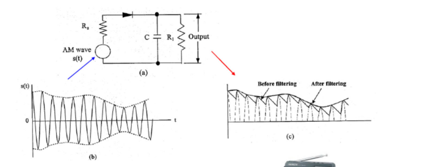

# 情報通信工学まとめ

# 1. 信号とシステム
- 信号のエネルギー

$$ E_g = \int_{-\infty}^{\infty} |g(t)|^2 dt $$

- 信号の電力

$$ P_g = \lim_{T \to \infty} \frac{1}{T} \int_{-T/2}^{T/2} |g(t)|^2 dt $$

- フーリエ級数展開
  
$$ g(t) = \sum_{n=-\infty}^{\infty} c_n e^{j2\pi f_0 n t} $$

$$ c_n = \frac{1}{2\pi}\int_{-\pi}^{\pi}g(t)e^{-j2\pi f_0nt} dt $$

- フーリエ変換
  
$$ G(f) = \frac{1}{2\pi}\int_{-\infty}^{\infty} g(t) e^{-j2\pi ft} dt $$

$$ g(t) = \int_{-\infty}^{\infty} G(f) e^{j2\pi ft} df $$

# 2. 信号の分析と伝送

# 3. アナログ変調（振幅変調）

## 1. 抑圧搬送波両側波帯（Double Sideband Suprressed Carrier, DSB-SC）

$$ s(t) = m(t)\cos(\omega_c t+ \phi) $$

のように、 $\cos$ で変調する方法。以下、 $\phi = 0$ とする。 

フーリエ変換は

$$ S(f) = \frac{1}{2} (M(f+f_c)+ M(f-f_c))$$

のように、2つに分かれて振幅半分となる。

また、要求されるチャネル帯域幅は、 $2f_c$ となる。

要求される送信電力

$$ P_s = \lim_{T\to \infty} \frac{1}{T} \int_{-T/2}^{T/2} s^2(t)dt = \frac{A_c^2}{2}\lim_{T\to\infty}\int_{-T/2}^{T/2}m^2(t)[1+\cos(2\omega_c t + 2\theta_0)] dt \\= \frac{A_c^2}{2}P_m $$

USB ... upper side band
LSB ... lower side band

- 復調方法
  -  $\cos(2\pi f_c t)$ をかけてLPFに通して行う。
  
$$ e(t) = s(t)\cos(2 \pi f_c t) = m(t) \cos^2(2\pi f_c t) = \frac{1}{2}m(t) + \frac{1}{2}\cos(4\pi f_c t) $$

- 受信側にPLLを用意して、受信信号を同期させる必要がある。

## 2. 振幅変調 (Commercial AM)

$$ s(t) = A_c (1+ m(t)) \cos(2\pi f_c t)  = A_c(1+k_am(t))\cos(2\pi f_c t)$$

受信側にPLLが必要なくなるので、普通のAM。

$k_a < 1$ が満たされる限り、 $m(t)$ から $s(t)$ を復元出来る。

また、 $m(t)$ のバンド幅は $f_c$ よりも十分に小さい必要がある。なぜなら、 $s(t)$のフーリエ変換が以下だから。

$$ S(f) = \frac{1}{2}A_c(\delta(f+f_c)+\delta(f-f_c)) + \frac{1}{2}k_aA_c(M(f+f_c)+M(f-f_c)) $$

こんな感じで波が来る。LPFだけで復元が出来る。

必要なバンド幅は $2f_c$

必要な電力は

$$ P = \lim_{T\to\infty} \frac{1}{T} \int_{-T/2}^{T/2}s^2(t)dt = \frac{A_c^2}{2} + \frac{k_a^2A_c^2}{2}P_m $$

変調効率

$$ E = \frac{power in sideband}{total power} = \frac{\frac{k_a^2A_c^2}{2}P_m}{ \frac{A_c^2}{2} + \frac{k_a^2A_c^2}{2}P_m} = \frac{k_a^2P_m}{1+k_a^2P_m} $$

### 包絡線検波

受信信号が

$$ s(t) = E(x)\cos\omega_ct $$

で表される時、E(x)をs(t)の包絡線という。

- f_c >> m(t)のバンド幅（スペクトルが重ならないように）
- A+m(t) >= 0 （位相の反転を防ぐ）
- A>m(t)

であれば、復元ができる。

## 3. 抑圧搬送波単側波帯（Single Sideband Suppressed Carrier, SSB-SC）
DSB-SCとAMは2倍のバンド幅を使うので、帯域幅の点で言えば非効率。USB/LSBどっちからでも復元が可能

例えば、USBの場合

$$ M_{+}(f) = M(f)u(f) = M(f)\frac{1}{2}[1+sgn(f)] = \frac{1}{2}[M(f)+jM_h(f)] $$

$$ M_h(f) = M(f)[-j\ sgn(f)] $$

$$ sgn(f) = 1 (f>0) , 0 (f=0) , -1 (f<0) $$

あんまよくわからん…

## 4. 残留側波帯 (Vestigial Sideband, VSB)

SSBは直流成分がないので使えたが、直流成分がある場合（動画など）には使用できない。

VSBは片側に加えて、不必要なサイドバンドをわずかに残し、直流成分を残す。

## 5. Quadrature Amplitude Modulation (QAM)
直交する搬送波を用いて、2つの波を同じ帯域幅を使用して送信する。

$$ m_QAM(t) = m_1(t)\cos(2\pi f_c t) + m_2(t)\sin(2\pi f_c t) $$

鋭い特性を持つバンドパスフィルタは必要ない。テレビなどで使用されている。

# 4. アナログ変調（周波数・位相変調）

//TODO: ここから先を書く

# 5. 標本化定理とパルス変調

# 6. 伝送路符号化

# 7. デジタル変調

# 8. 確率過程と最適信号検出

# 最後の問題対策

- $E_b/n_0$が重要である理由について、整合フィルタとの関係を含めて說明せよ。
  - $x(t) = s(t) + n(t)$ で表されるような信号を考えると、これのSNRは、
  $$ SNR = \frac{s_0^2(t_0)}{E[n_0^2(t)]} \leq \frac{2E}{N_0} $$

    となって、SNRの最大値が $E_b/n_0$によって決定される。整合フィルタはこのSNRが最大になるようなフィルタのことである。

    - 計算式を詳細に書くと、分子において
    $$ |\int_{-\infty}^{\infty}S(f)H(f)e^{j2\pi ft_0} df|^2 \leq \int_{-\infty}^{\infty} |H(f)|^2 df \int_{-\infty}^{\infty} |S(f)|^2 df$$
    から求まる。また、等号成立条件は
    $$ H(f) = kS*(f)e^{-j2\pi ft_0} $$
    であり、これから整合フィルタの伝達関数が求まる。
    $$ h(t) = kS_i(t_0-t) (0 \leq t \leq t_0)$$

- 整合フィルタをかけたあとの誤り率について考える。例えばBPSKの場合信号間の距離の半分以上の雑音が入る確率を考えて、
  $$ P_e = Q(\frac{d/2}{\sqrt{N_0/2}}) $$
  ここで、$d = 2\sqrt{E_b}$であるから、
  $$ P_e = Q(\sqrt\frac{2E_b}{N_0}) $$
  となって、 $E_b/N_0$の関数となることがわかる。また、Q関数は引数が大きいほど、小さくなるため、振幅を大きくしたり、送信間隔を大きくしてエネルギーを増加させたり、雑音を減らすことで誤り率を減らすことができるということがわかる。